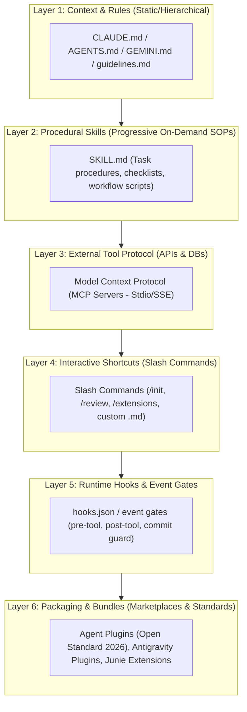

# Universal AI Agent Extensibility: Grand Overview (2026)

Across the modern autonomous coding agent landscape, agent extensibility has converged into a **6-Layer Extensibility Taxonomy**. Every major agent (Claude Code, OpenAI Codex, Google Antigravity, JetBrains Junie, Pi Agent) implements these layers through specific file formats and protocols.

---

## 1. The 6 Universal Layers of Agent Extensibility



---

## 2. Comparative Matrix Across All 5 Agents

| Capability / Layer | 🟣 Claude Code (Anthropic) | 🟢 OpenAI Codex CLI | 🔵 Google Antigravity | 🟠 JetBrains Junie | ⚪ Pi Coding Agent |
| :--- | :--- | :--- | :--- | :--- | :--- |
| **1. Project Rules & Context** | `CLAUDE.md`, Auto-memory | `AGENTS.md` (root & parent hierarchy) | `GEMINI.md`, `AGENTS.md`, `.agents/rules/` | `.junie/guidelines.md`, `AGENTS.md` | `.pi/SYSTEM.md`, `AGENTS.md`, `SYSTEM.override.md` |
| **2. Procedural Skills** | Skills (`SKILL.md` / `/skill-name`) | Agent Skills (`.codex/skills/<name>/SKILL.md`) | Progressive Skills (`.agents/skills/<name>/SKILL.md`) | Skills (`.junie/skills/<name>/SKILL.md`) | Skills (`.pi/skills/<name>/SKILL.md`) |
| **3. External Tools (MCP)** | Native MCP (`claude mcp add`) | Native MCP (`mcp_config.json`) | Native MCP (`mcp_config.json`) | Native MCP via extensions | Native MCP & custom bash/node tools |
| **4. Slash Commands** | `.claude/commands/*.md` & built-ins | Shell commands & `/command` | Slash commands (`/goal`, `/boost`) | Custom slash commands & `/extensions` | Slash commands (`/export`, `/clear`) |
| **5. Runtime Hooks** | Event hooks, approval gates | Tool execution hooks | `hooks.json` (pre-tool, post-tool) | Lifecycle hooks & permission gates | Event gates for bash/edit tools |
| **6. Bundled Plugins** | MCP Connectors & Directory | **Agent Plugins** (Open standard) | `plugins/<name>/plugin.json` | Junie Extensions (`/extensions`) | NPM/Git community packages |

---

## 3. How the Local Agent Toolchain (LAT) Bridges Them

Before LAT, developers had to maintain 5 different folders and syntaxes. LAT provides a unified abstraction:

```text
workspace/skills/my-skill/
├── SKILL.md
├── scripts/
└── examples/
```

Running `skill install my-skill`:
* Creates symlink in `~/.claude/commands/my-skill.md` & Claude Skills.
* Creates symlink in `.codex/skills/my-skill/`.
* Creates symlink in `.agents/skills/my-skill/`.
* Creates symlink in `.junie/skills/my-skill/`.
* Creates symlink in `.pi/skills/my-skill/`.

**One single skill definition is instantly active and synchronized across all 5 AI agent engines.**
