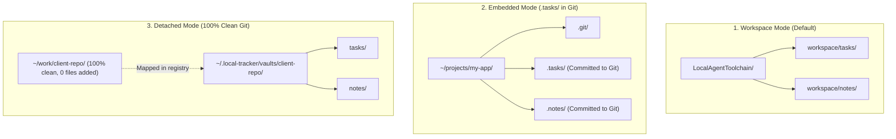
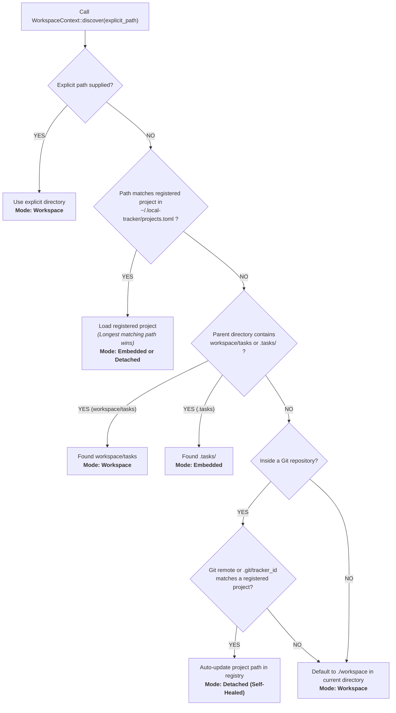

# Specification: Shared Core Engine (`tracker-core`)

## 1. Overview & Core Principles

The `tracker-core` crate (`crates/core`) is the shared foundational library for the entire Local Task Tracker and Orchestrator workspace. It encapsulates project context resolution, multi-project storage modes, Git remote fingerprinting with self-healing path recovery, and central registry management.

All present and future CLI and service modules (`task`, `note`, `runner`, `secrets`, etc.) depend on `tracker-core` for unified path and project discovery.

### Core Principles
- **Single Source of Truth for Paths:** No module resolves paths manually. Every module queries `WorkspaceContext::discover()`.
- **Zero Configuration for Humans & AI Agents:** Commands automatically infer the active project and target directories from the current working directory (CWD).
- **Git-Agnostic & Clean-Git Ready:** Supports both in-repo storage (committed to Git) and detached external storage (zero files committed to Git).
- **Self-Healing on Directory Moves:** If a project directory is moved or renamed, the engine automatically matches its Git remote origin and self-heals the registered path without user intervention.
- **Sub-Millisecond Resolution:** Completely in-memory path checking and filesystem metadata traversal executed in <1ms.

---

## 2. Storage Modes

The engine provides three distinct storage modes for projects:



| Mode | Target Layout | Use Case |
| :--- | :--- | :--- |
| **`Workspace`** | `./workspace/tasks`, `./workspace/notes` | Standalone local tracker or centralized orchestrator repository. |
| **`Embedded`** | `./.tasks/`, `./.notes/` inside the project root | Team projects where tasks and specs should travel with the code and be versioned in Git. |
| **`Detached`** | `~/.local-tracker/vaults/<project>/` | Client projects, NDA repositories, open-source projects where the repository must remain 100% clean. |

---

## 3. Cascading Resolution Algorithm

When `WorkspaceContext::discover(explicit_path)` is executed, it runs the following priority cascade:



---

## 4. Central Registry Specification

### Registry File: `~/.local-tracker/projects.toml`

The registry tracks all known projects on the machine. By default, it resides at `~/.local-tracker/projects.toml` (configurable via `TRACKER_HOME` environment variable):

```toml
[projects.local_agent_toolchain]
name = "local_agent_toolchain"
path = "/Users/developer/workspace/LocalAgentToolchain"
storage = "/Users/developer/workspace/LocalAgentToolchain"
git_remote = "github.com/developer/LocalAgentToolchain"
updated_at = "2026-09-03T00:00:00+00:00"

[projects.client_api]
name = "client_api"
path = "/Users/developer/work/client-api"
storage = "/Users/developer/.local-tracker/vaults/client_api"
git_remote = "github.com/client/client-api"
updated_at = "2026-09-03T00:50:00+00:00"
```

### Schema

| Field | Type | Description |
| :--- | :--- | :--- |
| `name` | `String` | Project unique key and identifier. |
| `path` | `PathBuf` | Absolute path to project root on the local filesystem. |
| `storage` | `PathBuf` | Absolute path to directory storing `tasks/`, `notes/`, `runs/`. |
| `git_remote` | `Option[String]` | Normalized Git remote URL (`github.com/owner/repo`). |
| `updated_at` | `Option[String]` | ISO 8601 timestamp of last registration or self-healing. |

---

## 5. Public Rust API (`tracker_core`)

Any crate in the Cargo Workspace adds `tracker-core = { path = "../core" }` to `Cargo.toml`.

### 1. `WorkspaceContext`

```rust
use tracker_core::{WorkspaceContext, StorageMode};

// Discover active context based on CWD
let ctx = WorkspaceContext::discover(None)?;

println!("Project Name: {}", ctx.project_name);
println!("Storage Mode: {}", ctx.mode);
println!("Tasks Directory: {:?}", ctx.tasks_dir);
println!("Notes Directory: {:?}", ctx.notes_dir);
println!("Runs Directory: {:?}", ctx.runs_dir);
```

### 2. Project Initialization (`init_project`)

```rust
use tracker_core::WorkspaceContext;

// Initialize embedded project (.tasks/ in current folder):
let embedded_ctx = WorkspaceContext::init_project(&current_dir, Some("my-app"), false)?;

// Initialize detached project (external vault, clean git):
let detached_ctx = WorkspaceContext::init_project(&current_dir, Some("client-app"), true)?;
```

### 3. Registry Operations (`Registry`)

```rust
use tracker_core::Registry;

// List all registered projects across the machine:
let projects = Registry::list();

// Register or update project:
Registry::register("proj_name", &project_path, &storage_path, Some(git_remote_url))?;

// Find project by current directory:
if let Some(project) = Registry::find_by_path(&current_dir) {
    println!("Found project: {}", project.name);
}
```

---

## 6. CLI Commands & Agent JSON Protocol

The core functionality is exposed through CLI commands in modules:

### 1. `task info` (Inspect Active Context)
```bash
task info
task info --json
```

Agent JSON Output:
```json
{
  "project": "client_api",
  "mode": "detached",
  "root_path": "/Users/developer/work/client-api",
  "tasks_dir": "/Users/developer/.local-tracker/vaults/client_api/tasks",
  "notes_dir": "/Users/developer/.local-tracker/vaults/client_api/notes"
}
```

### 2. `task init` (Initialize Project)
```bash
# Embedded (default):
task init

# Detached (external vault, clean git):
task init --detached --name my-client-project
```

### 3. `task projects` (List Registered Projects)
```bash
task projects
task projects --json
```

Agent JSON Output:
```json
[
  {
    "name": "client_api",
    "path": "/Users/developer/work/client-api",
    "storage": "/Users/developer/.local-tracker/vaults/client_api",
    "git_remote": "github.com/client/client-api",
    "updated_at": "2026-09-03T00:50:00+00:00"
  }
]
```
