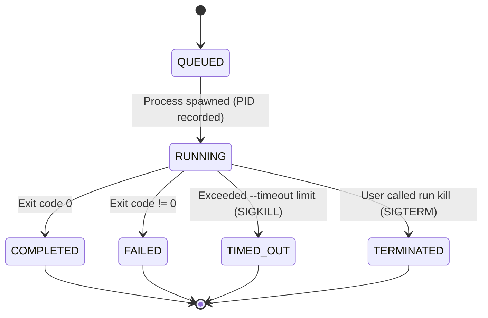

# Specification: Process Supervisor & Agent Runner (`run`)

## 1. Overview & Core Purpose

The **Runner** (`crates/runner`, binary `run`) is the execution engine and process supervisor of the Local Agent Toolchain. It enables human developers and AI orchestrators to launch, monitor, inspect, and safely terminate long-running processes, test suites, and autonomous AI agents (Claude Code, OpenAI Codex, Antigravity, local LLMs).

### Core Responsibilities
- **Background & Detached Execution:** Spawns jobs in detached background sessions without locking the user's terminal.
- **Process Supervision:** Tracks OS Process IDs (PIDs), exit codes, execution duration, and memory/CPU lifecycle.
- **Task Auto-Linking (`task` integration):**
  - `--task <ID>`: Automatically transitions the task to `in_progress`.
  - Automatically logs process start, PID, execution time, and exit status into task history.
- **Safety Watchdog & Timeouts:** Enforces maximum execution timeouts (`--timeout 15m`). Sends `SIGTERM` followed by `SIGKILL` on timeout to prevent runaway token spend or infinite loops.
- **Isolated Log Streaming:** Streams merged stdout/stderr directly into `workspace/runs/logs/<run-id>.log` (or the project's detached vault).
- **Log Tailing & Monitoring:** CLI commands to tail live logs (`run logs <run-id> -f`) and inspect active jobs (`run ps`).

---

## 2. Process Lifecycle State Machine



### Run Metadata Schema (`runs/<run-id>.json`)

```json
{
  "id": "run-001",
  "command": "cargo test --all",
  "pid": 48219,
  "status": "RUNNING",
  "task_id": "task-002",
  "skill": "test-generator",
  "started_at": "2026-09-05T00:15:00Z",
  "finished_at": null,
  "exit_code": null,
  "timeout_secs": 600,
  "log_file": "/Users/.../workspace/runs/logs/run-001.log"
}
```

---

## 3. Storage & Directory Layout

Runner integrates with `tracker-core` (`WorkspaceContext::discover()`):

```text
workspace/runs/          # Or ~/.local-tracker/vaults/<project>/runs/ in Detached Mode
├── metadata/            # JSON records for each run
│   ├── run-001.json
│   └── run-002.json
└── logs/                # Merged stdout and stderr outputs
    ├── run-001.log
    └── run-002.log
```

---

## 4. CLI Commands Reference

### 1. `run exec <COMMAND...>`
Spawns and supervises a process.

```bash
run exec [OPTIONS] -- <COMMAND...>
```
- `-d, --detach`: Run process in background (detached). Returns run ID immediately.
- `-t, --task <TASK_ID>`: Link run to a task. Auto-updates task status and logs start/exit.
- `-s, --skill <SKILL>`: Associate with an active skill context.
- `--timeout <DURATION>`: Timeout limit (e.g. `10m`, `300s`, `1h`). Default: none.
- `--name <NAME>`: Human-readable label for the run.

Examples:
```bash
# Run cargo test in background linked to task-002 with 5m timeout:
run exec -d --task task-002 --timeout 5m -- cargo test

# Launch autonomous Claude Code agent session in background:
run exec -d --task task-003 --timeout 30m -- claude -p "Implement user authentication"
```

---

### 2. `run ps` (alias `run list`)
Display active and recent process executions.

```bash
run ps [OPTIONS]
```
- `-a, --all`: Show completed and failed runs (default: active running processes only).
- `--json`: Output as machine-readable JSON array.

Example Output:
```text
┌─────────┬───────┬─────────────┬──────────┬──────────┬──────────┬────────────────────────────┐
│ RUN ID  │ PID   │ STATUS      │ TASK     │ DURATION │ TIMEOUT  │ COMMAND                    │
├─────────┼───────┼─────────────┼──────────┼──────────┼──────────┼────────────────────────────┤
│ run-001 │ 48219 │ RUNNING     │ task-002 │ 00:02:14 │ 00:05:00 │ cargo test                 │
│ run-002 │ 48301 │ RUNNING     │ task-003 │ 00:00:45 │ 00:30:00 │ claude -p "Implement..."   │
└─────────┴───────┴─────────────┴──────────┴──────────┴──────────┴────────────────────────────┘
```

---

### 3. `run logs <RUN_ID>`
View or stream logs from a run.

```bash
run logs <RUN_ID> [OPTIONS]
```
- `-f, --follow`: Stream live log updates (like `tail -f`).
- `-n, --tail <LINES>`: Output only the last N lines (default: all).

---

### 4. `run kill <RUN_ID>`
Safely terminate a running process.

```bash
run kill <RUN_ID> [OPTIONS]
```
- Sends `SIGTERM`, waits 5 seconds, then sends `SIGKILL` if still alive.
- Records `TERMINATED` status in run metadata.
- If linked to a task, logs: `task log <ID> "Process run-001 terminated by user"`.

---

### 5. `run clean`
Clean up old finished runs and log files.

```bash
run clean [--older-than 7d] [-y, --yes]
```
