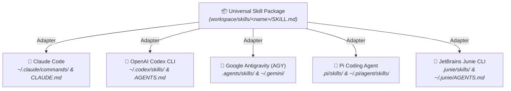

# Specification: AI Agent Skill Manager (`skill`)

## 1. Overview & Motivation

The **Skill Manager** (`crates/skill`, binary `skill`) is a dedicated multi-agent capability packaging and deployment engine. It bridges local developer knowledge (tasks, guidelines, runbooks, workflows) with autonomous AI coding agents.

### Why a Dedicated Skill Manager?
- **Single Responsibility Principle (SRP):** Task management (`task`) and knowledge management (`note`) remain razor-sharp. Agent integration is a distinct domain.
- **Universal Multi-Agent Support:** Developers use different AI tools (**Claude Code, OpenAI Codex, Google Antigravity, Pi, JetBrains Junie**). The Skill Manager translates and deploys skills into the native discovery directories of each agent automatically.
- **Dual Scopes (Local Project vs. Global Machine):**
  - **Local (`--project` / `--local`):** Injects project-specific coding standards, architecture constraints, and local tools into the current repository.
  - **Global (`--user` / `--global`):** Deploys personal superpowers (e.g., `task` and `note` commands) to the user's home environment, making them available across all repositories on the machine.
- **Live Symlinking (`--link`):** Enables "live" skills—updating a skill in the repository immediately propagates to all agents without reinstallation.

---

## 2. Comparative Analysis of Supported Agents

Research of the latest documentation and specifications across the 5 target coding agents:



### Discovery Paths & Configuration Reference Table

| Agent | Project / Local Scope | User / Global Scope | Native Skill Format | Primary Trigger Mechanism |
| :--- | :--- | :--- | :--- | :--- |
| **Claude Code** (Anthropic) | `./CLAUDE.md`<br>`./.claude/commands/<name>.md` | `~/.claude/CLAUDE.md`<br>`~/.claude/commands/<name>.md` | Markdown Prompt / Slash Command | `/command` or prompt context matching |
| **OpenAI Codex CLI** | `./AGENTS.md`<br>`./.codex/skills/<name>/SKILL.md` | `~/.codex/skills/<name>/SKILL.md` | `SKILL.md` (YAML frontmatter + SOP) | Semantic matching on `description` |
| **Google Antigravity** | `./AGENTS.md`<br>`./.agents/skills/<name>/SKILL.md` | `~/.gemini/config/skills/<name>/`<br>`~/.gemini/antigravity/skills/` | `SKILL.md` with progressive disclosure | On-demand tool invocation / model decision |
| **Pi Coding Agent** | `./AGENTS.md`<br>`./SYSTEM.md`<br>`./.pi/skills/<name>/` | `~/.pi/agent/skills/<name>/` | Modular skill package (scripts + markdown) | `--skill <path>` or directory scan |
| **JetBrains Junie CLI** | `./AGENTS.md`<br>`./.junie/guidelines.md`<br>`./.junie/skills/<name>/Skill.md` | `~/.junie/AGENTS.md`<br>`~/.junie/skills/<name>/Skill.md` | `Skill.md` (Progressive disclosure) | Task relevance matching / `@` reference |

---

## 3. Universal Skill Format (`SKILL.md`)

All skills are authored once in our central store (`workspace/skills/<skill-name>/`) using the open `SKILL.md` standard.

```text
workspace/skills/<skill-name>/
├── SKILL.md             # Standard manifest + procedure instructions
├── scripts/             # (Optional) Helper executable scripts (Bash, Python, Rust)
└── examples/            # (Optional) Few-shot input/output examples
```

### `SKILL.md` Structure

```markdown
---
name: task-manager
description: Manage project tasks, view Kanban boards, check off steps, and log progress using the local task CLI tool.
version: 0.1.0
author: local-orchestrator
triggers:
  - task
  - todo
  - kanban
  - checklist
---

# Task Manager Standard Operating Procedure (SOP)

When the user asks to manage tasks, review progress, or track work:
1. Always query current tasks using machine-readable output:
   `task list --json`
2. If working on a specific task:
   - Transition to in-progress: `task start <ID>`
   - Mark checklist steps complete: `task check <ID> <index>`
   - Log critical actions or benchmark results: `task log <ID> "<message>"`
3. When finished, mark as done:
   `task done <ID>`
```

---

## 4. Target Adapters Architecture

The `skill` manager implements distinct adapters to deploy skills to the appropriate agent format:

### 1. Claude Adapter (`Target::Claude`)
- **Global:** Creates a slash command file in `~/.claude/commands/<skill-name>.md`.
  - When the user runs `/task-manager`, Claude executes the SOP instructions.
- **Local:** Appends skill reference and commands summary into `./CLAUDE.md`.

### 2. Codex Adapter (`Target::Codex`)
- **Global:** Deploys folder to `~/.codex/skills/<skill-name>/SKILL.md`.
- **Local:** Deploys folder to `./.codex/skills/<skill-name>/SKILL.md` and appends skill summary to `./AGENTS.md`.

### 3. Antigravity Adapter (`Target::Antigravity`)
- **Global:** Deploys to `~/.gemini/config/skills/<skill-name>/SKILL.md`.
- **Local:** Deploys to `./.agents/skills/<skill-name>/SKILL.md` (compatible with `.agent/` and `_agents/`) and updates `./AGENTS.md`.

### 4. Pi Adapter (`Target::Pi`)
- **Global:** Deploys to `~/.pi/agent/skills/<skill-name>/`.
- **Local:** Deploys to `./.pi/skills/<skill-name>/` and registers in `./AGENTS.md`.

### 5. Junie Adapter (`Target::Junie`)
- **Global:** Deploys to `~/.junie/skills/<skill-name>/Skill.md` and `~/.junie/AGENTS.md`.
- **Local:** Deploys to `./.junie/skills/<skill-name>/Skill.md` and `./AGENTS.md`.

---

## 5. CLI Commands Specification

### Command Reference

#### 1. `skill list`
List workspace skills or inspect existing skills installed across agents.

```bash
skill list [OPTIONS]
```
- `-i, --installed`: **Deep scan installed agent skills on the machine.** Scans native agent directories (`~/.claude/commands/`, `~/.codex/skills/`, `~/.gemini/config/skills/`, `~/.pi/agent/skills/`, `~/.junie/skills/`, and project directories) and displays all existing skills (both custom and third-party).
- `-t, --target <TARGET>`: Filter by specific agent (`claude`, `codex`, `antigravity`, `pi`, `junie`).
- `--json`: Output full array in machine-readable JSON.

Example Output with `--installed`:
```text
═══ Installed Agent Skills ══════════════════════════════════════════════════════

🤖 Claude Code
  [Global: ~/.claude/commands/]
    • task.md (symlink -> /Users/.../workspace/skills/task-manager/SKILL.md)
    • note.md (symlink -> /Users/.../workspace/skills/knowledge-base/SKILL.md)
    • legacy-git-helper.md (file)

🤖 OpenAI Codex
  [Global: ~/.codex/skills/]
    • task-manager (symlink)
    • community-react-expert (directory)

🤖 Google Antigravity
  [Global: ~/.gemini/config/skills/]
    • agy-customizations (built-in)
    • google-antigravity-sdk (plugin)

🤖 JetBrains Junie
  [Local: ./.junie/skills/]
    • code-reviewer (directory)
```

#### 2. `skill install <NAME>`
Deploy a skill into agent directories.

```bash
skill install <NAME> [OPTIONS]
```
- `-t, --target <TARGET>`: Specific agent (`claude`, `codex`, `antigravity`, `pi`, `junie`, or `all`). Default: `all` detected agents.
- `-g, --global`: Install into user home directories (`~/.claude/`, `~/.gemini/`, etc.).
- `-l, --local`: Install into current project repository (`./.agents/`, `./.junie/`, `./CLAUDE.md`, etc.). Default.
- `--link`: Create symbolic links instead of copying (ensures live updates without reinstallation).

#### 3. `skill remove <NAME>` (aliases: `uninstall`, `rm`)
Remove any installed skill from agent discovery directories (works on both local workspace skills and third-party skills).

```bash
skill remove <NAME> [OPTIONS]
```
- `<NAME>`: Name of the skill to delete or unlink (e.g. `legacy-git-helper` or `task-manager`).
- `-t, --target <TARGET>`: Specific agent to remove from (`claude`, `codex`, `antigravity`, `pi`, `junie`, or `all`). Default: `all` agents where the skill is detected.
- `-g, --global`: Remove from global user directory (`~/.claude/commands/`, `~/.codex/skills/`, etc.).
- `-l, --local`: Remove from local project directory (`./.agents/skills/`, `./.junie/skills/`, etc.).
- `-y, --yes`: Bypass confirmation prompt.

Example:
```bash
# Remove a specific legacy command from Claude:
skill remove legacy-git-helper --target claude --global -y

# Remove an obsolete skill from all agents in the current project:
skill remove old-reviewer --local -y
```

#### 4. `skill new <NAME>`
Scaffold a standardized skill package in `workspace/skills/<NAME>/`.

```bash
skill new <NAME> [--desc "<DESCRIPTION>"]
```
Creates:
- `workspace/skills/<NAME>/SKILL.md` (pre-filled with valid YAML frontmatter).
- `workspace/skills/<NAME>/scripts/`.
- `workspace/skills/<NAME>/examples/`.

#### 5. `skill show <NAME>`
Inspect the full contents of `SKILL.md`.

```bash
skill show <NAME> [--raw] [--json]
```

#### 6. `skill sync`
Inspect all detected agents on the machine and synchronize/link skills automatically.

```bash
skill sync [--global | --local]
```

---

## 6. Built-in Core Skills

The system ships with two core built-in skills:

1. **`task-manager`**:
   - Instructs agents on how to use `./target/release/task` with `--json`, manage checklists, and update task statuses.
2. **`knowledge-base`**:
   - Instructs agents on how to search notes (`note search`), follow Wikilinks (`[[...]]`), and write execution reports into `workspace/notes/40_Reports/`.
